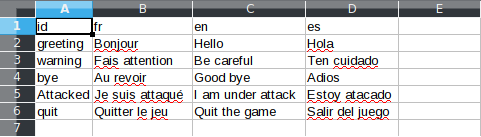

# maskerad_localization

[](https://travis-ci.org/Maskerad-rs/maskerad_localization)
[](https://ci.appveyor.com/project/Malkaviel/maskerad-localization)
[](https://codecov.io/gh/Maskerad-rs/maskerad_localization)

[](https://opensource.org/licenses/MIT)
[](https://opensource.org/licenses/Apache-2.0)

CLI tool to generate localized text from a CSV file to JSON files.

## Usage

```
maskerad_localization [CSV FILE] [OUTPUT DIRECTORY]
```

## Details

Let's say we have the following CSV file, called "translation.csv":


This tool expects that the CSV file has the following form:

- The first column is reserved to the identifiers.
- All fields of the first row, expect the first field, must be valid locales (fr, fr_FR, th_TH_TH).
- All fields must have content, they can't be empty.

We want to create 3 JSON files from this CSV file:

- A file for the French translation.
- A file for the Spanish translation.
- A file for the English translation.

The tool will read the first row, and create a JSON file for each locale detected.

Once the tool has finished creating and filling the files, it will save them in the
following hierarchy:

[OUTPUT DIRECTORY]/localization/{locale}/localization.json

```
# We are in the directory /home/my_user_name/my_project.
# The csv file is in the directory /home/my_user_name/translations.
# We want to generate all the JSON file in the current directory.

# How to use this tool:
# maskerad_localization [CSV FILE] [OUTPUT DIRECTORY]

maskerad_localization ../translations/translation.csv .
```

If we check the content of the my_project/ directory, we should see the following content:
```
my_project
|
|----miscellaneous files and directories
|
|----localization
|    |
|    |----en
|    |    |
|    |    |---- localization.json
|    |    
|    |----fr
|    |    |
|    |    |---- localization.json
|    |
|    |----es
|    |    |
|    |    |---- localization.json
```

The content of the JSON file for the french translation:

```json
{
  "warning": "Fais attention",
  "Attacked": "Je suis attaqué",
  "greeting": "Bonjour",
  "bye": "Au revoir",
  "quit": "Quitter le jeu"
}
```

The content of the JSON file for the English translation:

```json
{
  "Attacked": "I am under attack",
  "quit": "Quit the game",
  "warning": "Be careful",
  "greeting": "Hello",
  "bye": "Good bye"
}
```

The content of the JSON file for the Spanish translation:

```json
{
  "Attacked": "Estoy atacado",
  "quit": "Salir del juego",
  "greeting": "Hola",
  "bye": "Adios",
  "warning": "Ten cuidado"
}
```
## License

Licensed under either of

 * Apache License, Version 2.0, ([LICENSE-APACHE](LICENSE-APACHE) or http://www.apache.org/licenses/LICENSE-2.0)
 * MIT license ([LICENSE-MIT](LICENSE-MIT) or http://opensource.org/licenses/MIT)

at your option.

### Contribution

Unless you explicitly state otherwise, any contribution intentionally submitted
for inclusion in the work by you, as defined in the Apache-2.0 license, shall be dual licensed as above, without any
additional terms or conditions.